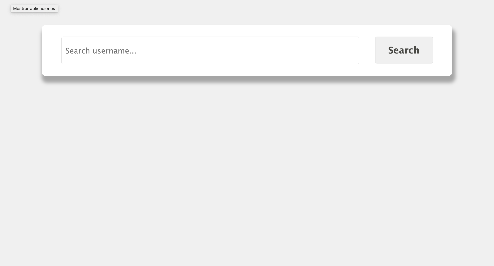
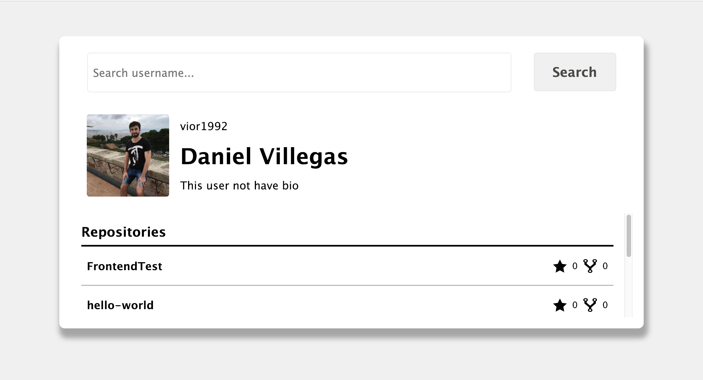
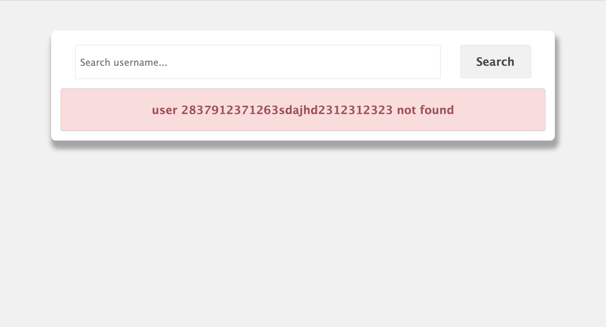
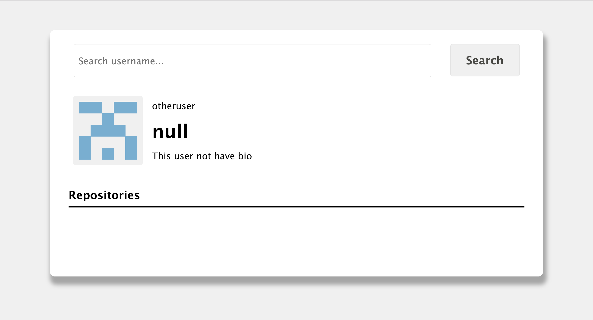
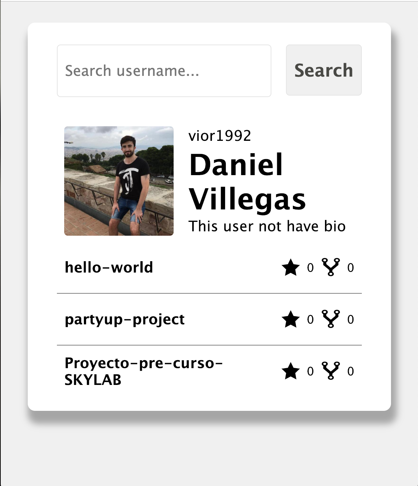

# FrontendTest

## TECHNICAL DESCRPTION
For build the app, I used javascript vanilla for scripts and CSS with BEM for styles.

It was tested with Jasmine.

## The app 
When the user open the app:

on success search:

on not found user:

new search:

responsive (movile):

